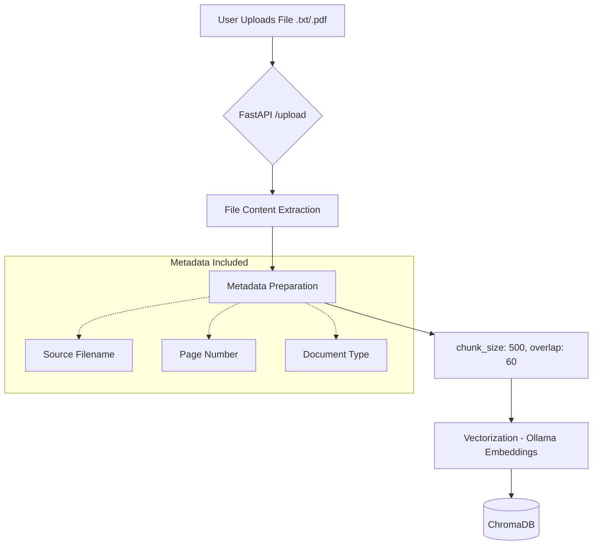

# RAG System Architecture

This document describes the flow of information from file ingestion to the final AI-generated response.

## 1. Document Ingestion Flow (File Input)

### Process Details:
- **Extraction:** PDF parsing handles text blocks and native markdown tables for high-fidelity context.
- **Chunking:** `RecursiveCharacterTextSplitter` ensures logical breaks (paragraphs, then sentences).
- **Storage:** Chunks are stored with unique UUIDs and metadata for targeted filtering.

---

## 2. Retrieval & Generation Flow (Query Output)

### Process Details:
- **Retrieval:** The system fetches the top `N` most relevant chunks based on vector similarity.
- **Augmentation:** The retrieved text is injected into a "System Prompt" to ground the LLM in specific facts.
- **Generation:** The response is streamed token-by-token to ensure low perceived latency.
- **Rendering:** `marked.js` converts the LLM's raw markdown output into rich HTML (bolding, lists, code blocks).

---

## 3. Tech Stack
- **Frontend:** HTML5, CSS3, JavaScript (Vanilla), Marked.js
- **Backend:** FastAPI (Python 3.13)
- **Vector Database:** ChromaDB
- **Embedding Model:** BGE-Base-en-v1.5 (Local via Ollama)
- **LLM:** Gemma 2b (Local via Ollama)
- **PDF Intelligence:** PyMuPDF (fitz)
